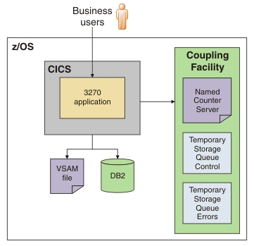

# Application architecture

The general insurance application is a 3270 application that runs in a single region. The application writes to a VSAM
file and Db2. As you start to use the application to try different features of CICS, the configuration of the
application changes to include additional components.

As a starting point, you can configure the application to use only VSAM and Db2. However, if you have access to a
coupling facility on z/OS you can extend the application to use a named counter server and temporary storage queues.
The application is summarized in the following diagram:

## Business users

The application has a 3270 interface that can be accessed from a terminal. The application uses a BMS map to control
the screen layout for the 3270 interface. The application has five transactions that you can run to perform different
tasks in the application:

* Run SSC1 to inquire on existing customer records and add customer records
* Run SSP1 to create a motor insurance policy
* Run SSP2 to create an endowment insurance policy
* Run SSP3 to create a house insurance policy
* Run SSP4 to create a commercial property insurance policy

The TRANSACTION resource definitions are supplied for you. Each transaction runs a program that provides the
presentation logic for the application.

## 3270 application

The application programs are written in COBOL and are split into presentation logic, business logic, and data
management logic. Designing the application in this way is a best practice and means that the application can be
easily componentized to run in a topology under the control of CICSPlex SM.

When a business function is selected from the application menu in the presentation logic, the program uses an
**EXEC CICS LINK PROGRAM** API command to call the correct program that contains the business logic. In the business
logic, the program links to the program that contains the data management logic by using the same API command. The
data management program takes control and performs updates to the Db2 database and VSAM file, before returning to the
business logic. The business logic layer returns to the presentation logic layer and the user.

When you add a customer record, the program that drives the business logic can either get a unique customer number
from the named counter server by using an **EXEC CICS GET COUNTER** API command or get a unique customer number from
Db2. When you add a policy, the policy number is generated by Db2 when the table is defined. The number is set by an
SQL **INSERT** command.

The application also updates temporary storage queues in the coupling facility. These are not required by the
application, but are provided for workload testing.

The application uses a two-phase commit to store customer and policy data in Db2 and, if successful, it updates VSAM.
The requirement for a VSAM file is not a best practice, but is provided as a way to test two-phase commit processing
in CICS.

## Named counter server

To support adding customer records to the database, the application can optionally use a named counter server in the
coupling facility to provide unique customer numbers. A named counter can generate unique sequence numbers for
applications. The advantage of using this approach is that all CICS regions in a Parallel Sysplex have access to the
same named counters. However, if your application uses Db2, you can use the features of Db2 to create unique customer
numbers for each record as they are added to the database.

## Temporary storage queue (control)

The temporary storage queue, GENACNTL, contains a record of the range of customer numbers that are allocated. The
application updates the temporary storage queue (control) as each customer record is added. Using a temporary storage
queue to contain this type of data is not a best practice, but is provided for Workload Simulator automation.

## Temporary storage queue (errors)

The temporary storage queue, GENAERRS, contains errors when the application is unable to write information to Db2.
Using a temporary storage queue in this way is not a best practice, but is used to easily identify any Db2 problems
during your testing.

## Coupling facility

The coupling facility is part of z/OS and contains a set of structures for the named counter server and temporary
storage queues used by the application. It contains a pool that associates the structures with the CICS region.

The coupling facility provides a mechanism to share data across logical partitions on a z/OS system. All CICS regions
operating within the same sysplex can access the data, even if they are in different partitions. Using the coupling
facility for an application in a single region is not typical, so the application is designed to use Db2. However, the
application can automatically use the coupling facility if you want to try out this feature. The coupling facility
becomes more important if you want to scale the application.

## VSAM file

The application stores information in VSAM files. The general insurance application uses two VSAM files: KSDSCUST for
customer records and KSDSPOLY for policy records. You can browse these files in the *userid*.GENAPP.KSDSCUST and
*userid*.GENAPP.KSDSPOLY data sets to look at the contents. The key for the KSDSCUST VSAM file is the first 10
characters of each customer record. The key for the policy VSAM file is the first 21 characters. The application uses
four types of policies, indicated by the initial letter:

* C is a commercial property insurance policy
* E is an endowment insurance policy
* H is a house insurance policy
* M is a motor insurance policy

The next 10 characters are the customer ID, followed by 10 characters for the policy number. For example,
`M00000000050000000003DENNIS` is a motor policy, where the customer number is 5, the policy number is 3, and the make
of car is Dennis.

## Db2

The database contains details of the customers and insurance policies for the application. The database contains the
following tables:

* A customer table that lists all the customer records, including the customer number.
* A policy table that lists all the policies, including the customer number, policy number, and policy type.
* A policy table for each type of policy: commercial, endowment, house, and motor insurance policies.

These tables are related for referential integrity; for example, you cannot create a policy if the customer record does
not exist. CICS uses the Db2 attachment facility to access the tables in the database to add and inquire on customer
and policy information.

## CICS region

The CICS region is configured with a set of system initialization parameters that enable CICS to connect with Db2 and
the coupling facility. The region also contains the resources required by the application, including a TSMODEL
resource with a pool name that matches the structure in the coupling facility, a DB2CONN resource for the connection
to Db2, and FILE resources. For a complete list of the CICS resources that are supplied with the application, see
[Reference.md](Reference.md).

## What to do next

The next step is to [install the application](Installation.md).
